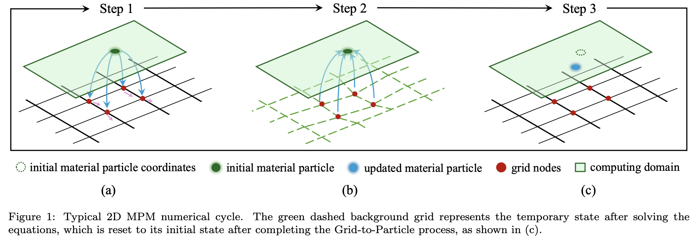

# Why?

This project began as a research initiative where we aimed to study the run-out process of landslides after instability through numerical simulations. However, this nonlinear large deformation problem is difficult to address using mesh-based methods because the mesh can become distorted. At this point, the Material Point Method (MPM), which combines a Lagrangian perspective with an Eulerian perspective, will be quite advantageous for this type of problem.



However, MPM does not have as many available software/codes as FEM, and there is also less work focused on computational performance. Notable examples include Anura3D, which is written in Fortran, and CB-Geo MPM, which is written in C++. Installing, configuring, and using these libraries is not easy. We hope to leverage the advantages of the Julia language to allow users to install with one click and achieve better performance.

These software and code, due to being written a long time ago, are no longer compatible with the rapidly developing computing resources of today. Currently, we mainly utilize the powerful performance of GPUs, and it is important to note that GPU vendors are not limited to NVIDIA. In this case, whether as researchers or related professionals, it would be a fantastic experience if we could write just one set of code that can run on different backends.

For these reasons, we have implemented ***MaterialPointSolver.jl***. I personally believe that its design coincidentally follows Victorinox's design principle: "design follows function." We develop new features driven by practical problems. Aside from its excellent performance, we try to choose simple implementation methods (a trade-off between performance and code readability), and it is very convenient to add custom features at any level, just like purchasing a Swiss Army Knife™, supporting personalization.

```@raw html
<div align="center">
    
</div>
```