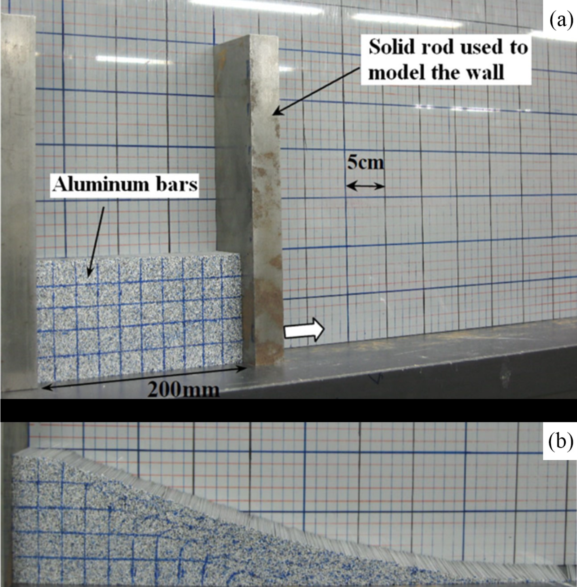

# One-phase single-point MPM

!!! note

    1) We use a classic example: 2D & 3D granular collapse[^1], to demonstrate how to establish computational models and solve them. 
    2) To successfully run the code, we will install the dependencies at the beginning of the code provided below. If you are already familiar with the Julia Pkg ENV and have installed the necessary packages, you can ignore this part.
    3) We default to using Nvidia's GPU or x86/ARM CPUs. If you want to use other acceleration backends, please make modifications in the appropriate places in the code.
    4) We use Unicode to enhance readability (when comparing formulas), but sometimes it may be confused with regular letters, such as ``\nu`` and `v`. If you are using VSCode, you can enable the following in the settings:
    
       ```json
       "editor.unicodeHighlight.ambiguousCharacters": true,
       ```

    5) You can copy and save it in the `your_file.jl` and run the file directly using Julia in `REPL`:

       ```julia-repl
       julia> include("path/to/your_file.jl")
       ```

        Or run this file in the terminal:

       ```bash
       bash> julia path/to/your_file.jl
       ```

[^1]: Bui, H.H., Fukagawa, R., Sako, K., Ohno, S., 2008. Lagrangian meshfree particles method (SPH) for large deformation and failure flows of geomaterial using elastic–plastic soil constitutive model. Int. J. Numer. Anal. Methods Geomech. 32, 1537–1570. https://doi.org/10.1002/nag.688


::: details Here is the complete 2D code

```julia
using Pkg
Pkg.add(["MaterialPointSolver", "MaterialPointGenerator", "CairoMakie", "CUDA"])
using MaterialPointSolver
using MaterialPointGenerator
using CairoMakie
using CUDA

MaterialPointSolver.warmup(Val(:CUDA))

init_grid_space_x = 0.0025
init_grid_space_y = 0.0025
init_grid_range_x = [-0.025, 0.82]
init_grid_range_y = [-0.025, 0.12]
init_mp_in_space  = 2
init_T            = 1
init_ρs           = 2650
init_ν            = 0.3
init_Ks           = 7e5
init_Es           = init_Ks * (3 * (1 - 2 * init_ν))
init_Gs           = init_Es / (2 * (1 +     init_ν))
init_ΔT           = 0.5 * init_grid_space_x / sqrt(init_Es / init_ρs)
init_step         = floor(init_T / init_ΔT / 200)
init_ϕ            = deg2rad(19.8)
init_NIC          = 9
init_basis        = :uGIMP
init_ϵ            = "FP64"

# args setup
args = UserArgs2D(
    Ttol         = init_T,
    Te           = 0,
    ΔT           = init_ΔT,
    time_step    = :fixed,
    FLIP         = 1,
    PIC          = 0,
    constitutive = :druckerprager,
    basis        = init_basis,
    hdf5         = false,
    hdf5_step    = init_step,
    MVL          = false,
    device       = :CPU,
    coupling     = :OS,
    scheme       = :MUSL,
    progressbar  = true,
    gravity      = -9.8,
    ζs           = 0,
    project_name = "2d_collapse",
    project_path = @__DIR__,
    ϵ            = init_ϵ
)

# grid setup
grid = UserGrid2D(
    ϵ     = init_ϵ,
    phase = 1,
    x1    = init_grid_range_x[1],
    x2    = init_grid_range_x[2],
    y1    = init_grid_range_y[1],
    y2    = init_grid_range_y[2],
    dx    = init_grid_space_x,
    dy    = init_grid_space_y,
    NIC   = init_NIC
)

# material point setup
dx = grid.dx / init_mp_in_space
dy = grid.dy / init_mp_in_space
ξ0 = meshbuilder(0 + dx / 2 : dx : 0.2 - dx / 2,
                0 + dy / 2 : dy : 0.1 - dy / 2)
mp = UserParticle2D(
    ϵ     = init_ϵ,
    phase = 1,
    NIC   = init_NIC,
    dx    = dx,
    dy    = dy,
    ξ     = ξ0,
    ρs    = ones(size(ξ0, 1)) .* init_ρs
)

# property setup
nid = ones(mp.np)
attr = UserProperty(
    ϵ   = init_ϵ,
    nid = nid,
    ν   = [init_ν],
    Es  = [init_Es],
    Gs  = [init_Gs],
    Ks  = [init_Ks],
    σt  = [0],
    ϕ   = [init_ϕ],
    ϕr  = [0],
    ψ   = [0],
    c   = [0],
    cr  = [0],
    Hp  = [0]
)

# boundary setup
vx_idx = zeros(grid.ni)
vy_idx = zeros(grid.ni)
tmp_idx = findall(i -> grid.ξ[i, 1] ≤ 0.0 || grid.ξ[i, 1] ≥ 0.8 ||
                    grid.ξ[i, 2] ≤ 0, 1:grid.ni)
tmp_idy = findall(i -> grid.ξ[i, 2] ≤ 0, 1:grid.ni)
vx_idx[tmp_idx] .= 1
vy_idx[tmp_idy] .= 1 
bc = UserVBoundary2D(
    ϵ        = init_ϵ,
    vx_s_idx = vx_idx,
    vx_s_val = zeros(grid.ni),
    vy_s_idx = vy_idx,
    vy_s_val = zeros(grid.ni)
)

# solver setup
materialpointsolver!(args, grid, mp, attr, bc)

# post-processing
let 
    figregular = MaterialPointSolver.tnr
    figbold = MaterialPointSolver.tnrb
    fig = Figure(size=(440, 142), fonts=(; regular=figregular, bold=figbold), fontsize=12,
        padding=0)
    ax = Axis(fig[1, 1], aspect=DataAspect(), xlabel=L"x\ (m)", ylabel=L"y\ (m)", 
        xticks=(0:0.1:0.5), yticks=(0:0.05:0.1))
    p1 = scatter!(ax, mp.ξ, color=log10.(mp.ϵq.+1), markersize=2, colormap=:turbo,
        colorrange=(0, 1.5))
    Colorbar(fig[1, 2], p1, spinewidth=0, label=L"log_{10}(\epsilon_{II}+1)", size=6)
    limits!(ax, -0.02, 0.52, -0.02, 0.12)
    display(fig)
end
```

:::

::: details Here is the complete 3D code

```julia
using Pkg
Pkg.add(["MaterialPointSolver", "MaterialPointGenerator", "CairoMakie", "CUDA"])
using MaterialPointSolver
using MaterialPointGenerator
using CairoMakie
using CUDA

MaterialPointSolver.warmup(Val(:CUDA))

init_grid_space_x = 0.0025
init_grid_space_y = 0.0025
init_grid_space_z = 0.0025
init_grid_range_x = [-0.02, 0.07]
init_grid_range_y = [-0.02, 0.75]
init_grid_range_z = [-0.02, 0.12]
init_mp_in_space  = 2
init_T            = 1
init_ρs           = 2650
init_ν            = 0.3
init_Ks           = 7e5
init_Es           = init_Ks * (3 * (1 - 2 * init_ν))
init_Gs           = init_Es / (2 * (1 +     init_ν))
init_ΔT           = 0.5 * init_grid_space_x / sqrt(init_Es / init_ρs)
init_step         = floor(init_T / init_ΔT / 50)
init_ϕ            = deg2rad(19.8)
init_FP           = "FP64"
init_basis        = :uGIMP
init_NIC          = 27

# args setup
args = UserArgs3D(
    Ttol         = init_T,
    Te           = 0,
    ΔT           = init_ΔT,
    time_step    = :fixed,
    FLIP         = 1,
    PIC          = 0,
    constitutive = :druckerprager,
    basis        = init_basis,
    hdf5         = false,
    hdf5_step    = init_step,
    MVL          = false,
    device       = :CUDA,
    coupling     = :OS,
    scheme       = :MUSL,
    gravity      = -9.8,
    ζs           = 0,
    project_name = "3d_collapse",
    project_path = @__DIR__,
    ϵ            = init_FP
)

# grid setup
grid = UserGrid3D(
    ϵ     = init_FP,
    phase = 1,
    x1    = init_grid_range_x[1],
    x2    = init_grid_range_x[2],
    y1    = init_grid_range_y[1],
    y2    = init_grid_range_y[2],
    z1    = init_grid_range_z[1],
    z2    = init_grid_range_z[2],
    dx    = init_grid_space_x,
    dy    = init_grid_space_y,
    dz    = init_grid_space_z,
    NIC   = init_NIC
)

# material point setup
dx = grid.dx / init_mp_in_space
dy = grid.dy / init_mp_in_space
dz = grid.dz / init_mp_in_space
pts = meshbuilder(0 + dx / 2 : dx : 0.05 - dx / 2,
                0 + dy / 2 : dy : 0.20 - dy / 2,
                0 + dz / 2 : dz : 0.10 - dz / 2)
mpρs = ones(size(pts, 1)) * init_ρs
mp = UserParticle3D(
    ϵ     = init_FP,
    phase = 1,
    NIC   = init_NIC,
    dx    = dx,
    dy    = dy,
    dz    = dz,
    ξ     = pts,
    ρs    = mpρs
)

# property setup
nid = ones(mp.np)
attr = UserProperty(
    ϵ   = init_FP,
    nid = nid,
    ν   = [init_ν],
    Es  = [init_Es],
    Gs  = [init_Gs],
    Ks  = [init_Ks],
    σt  = [0],
    ϕ   = [init_ϕ],
    ϕr  = [0],
    ψ   = [0],
    c   = [0],
    cr  = [0],
    Hp  = [0]
)

# boundary setup
vx_idx  = zeros(grid.ni)
vy_idx  = zeros(grid.ni)
vz_idx  = zeros(grid.ni)
tmp_idx = findall(i -> grid.ξ[i, 1] ≤ 0 || grid.ξ[i, 1] ≥ 0.05 ||
                    grid.ξ[i, 3] ≤ 0 || grid.ξ[i, 2] ≤ 0, 1:grid.ni)
tmp_idy = findall(i -> grid.ξ[i, 2] ≤ 0 || grid.ξ[i, 3] ≤ 0, 1:grid.ni)
tmp_idz = findall(i -> grid.ξ[i, 3] ≤ 0, 1:grid.ni)
vx_idx[tmp_idx] .= 1
vy_idx[tmp_idy] .= 1
vz_idx[tmp_idz] .= 1
bc = UserVBoundary3D(
    ϵ        = init_FP,
    vx_s_idx = vx_idx,
    vx_s_val = zeros(grid.ni),
    vy_s_idx = vy_idx,
    vy_s_val = zeros(grid.ni),
    vz_s_idx = vz_idx,
    vz_s_val = zeros(grid.ni)
)

# solver setup
materialpointsolver!(args, grid, mp, attr, bc)

# post-processing
let
    figfont = MaterialPointSolver.tnr
    fig = Figure(size=(1200, 700), fonts=(; regular=figfont, bold=figfont), fontsize=30)
    ax = Axis3(fig[1, 1], xlabel=L"x\ (m)", ylabel=L"y\ (m)", zlabel=L"z\ (m)", 
        aspect=:data, azimuth=0.2*π, elevation=0.1*π, xlabeloffset=60, zlabeloffset=80,
        protrusions=100, xticks=(0:0.04:0.04), height=450, width=950)
    pl1 = scatter!(ax, mp.ξ, color=log10.(mp.ϵq.+1), colormap=:jet, markersize=3,
        colorrange=(0, 1))
    Colorbar(fig[1, 1], limits=(0, 1), colormap=:jet, size=16, ticks=0:0.5:1, spinewidth=0,
        label=L"log_{10}(\epsilon_{II}+1)", vertical=false, tellwidth=false, width=200,
        halign=:right, valign=:top, flipaxis=false)
    display(fig)
end
```

:::

## 2D model description

```@raw html
<br>

<br>
```

In this example, aluminum bars are used to model the non-cohesive soil collapse. We use uGIMP to simulate the failure process of soil collapse. The geometry of the numerical model is depicted in the figure, with a length ``l`` of ``0.2\ m`` and a height ``h`` of ``0.1\ m``. The parameters of the numerical model are provided in the Table.

| Parameter   | Value            | Unit       | Description            |
|:-----------:|:----------------:|:----------:|:----------------------:|
| ``\rho``    | ``2650``         | ``kg/m^3`` | density                |
| ``\mu``     | ``0.3``          | -          | Poisson's ratio        |
| ``K``       | ``7\times 10^5`` | ``Pa``     | bulk modulus           |
| ``t_{sim}`` | ``1.0``          | second     | simulation time        |
| ``\phi``    | ``19.8``         | degree     | friction angle         |
| ``\alpha``  | ``1.0``          |  -         | FLIP-PIC mixing factor |

## 2D code explaination

Step1: We import the required packages and perform warming up (optional):

```julia
using MaterialPointSolver              # MPM solver
using MaterialPointGenerator           # Particle generator
using CairoMakie                       # post-processing
using CUDA                             # backend package

MaterialPointSolver.warmup(Val(:CUDA)) # warm-up
```

Step2: Some values used in the simulation:

```julia
init_grid_space_x = 0.0025                                            # background grid space in x direction
init_grid_space_y = 0.0025                                            # background grid space in y direction
init_grid_range_x = [-0.025, 0.82]                                    # background grid x range
init_grid_range_y = [-0.025, 0.12]                                    # background grid y range
init_mp_in_space  = 2                                                 # there are 2 particles in x direction per cell, so 4 in total per cell
init_T            = 1                                                 # simulation time, here is 1 second
init_ρs           = 2650                                              # particle density
init_ν            = 0.3                                               # Poisson's ratio
init_Ks           = 7e5                                               # bulk modulus
init_Es           = init_Ks * (3 * (1 - 2 * init_ν))                  # elastic modulus
init_Gs           = init_Es / (2 * (1 +     init_ν))                  # shear modulus
init_ΔT           = 0.5 * init_grid_space_x / sqrt(init_Es / init_ρs) # time step in second
init_step         = floor(init_T / init_ΔT / 200)                     # save data into hdf5 per 200 time steps
init_ϕ            = deg2rad(19.8)                                     # friction angle
init_NIC          = 9                                                 # 9 is used for uGIMP in 2D
init_basis        = :uGIMP                                            # basis function
init_ϵ            = "FP64"                                            # computing precision
```

Step3: Initialize `Args2D`:

```julia
# args setup
args = UserArgs2D(
    Ttol         = init_T,
    Te           = 0,
    ΔT           = init_ΔT,
    time_step    = :fixed,
    FLIP         = 1,
    PIC          = 0,
    constitutive = :druckerprager, # constitutive model
    basis        = init_basis,
    hdf5         = false,
    hdf5_step    = init_step,
    MVL          = false,
    device       = :CPU,           # use CPU for the simulation 
    coupling     = :OS,            # one-phase single-point mpm
    scheme       = :MUSL,          # stress update scheme
    progressbar  = true,
    gravity      = -9.8,
    ζs           = 0,              # damping force factor
    project_name = "2d_collapse",  # project name
    project_path = @__DIR__,       # project path
    ϵ            = init_ϵ
)
```


## 3D model description

## 3D code explaination