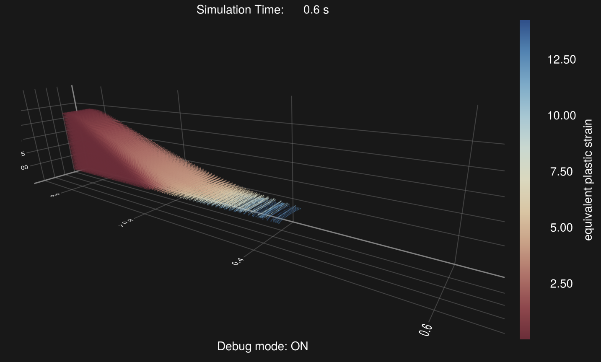
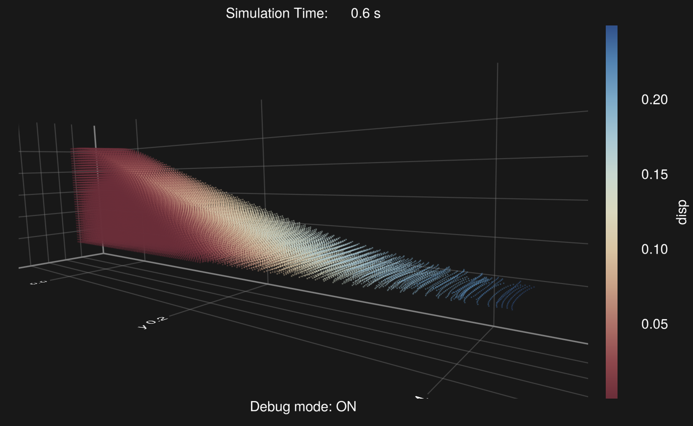
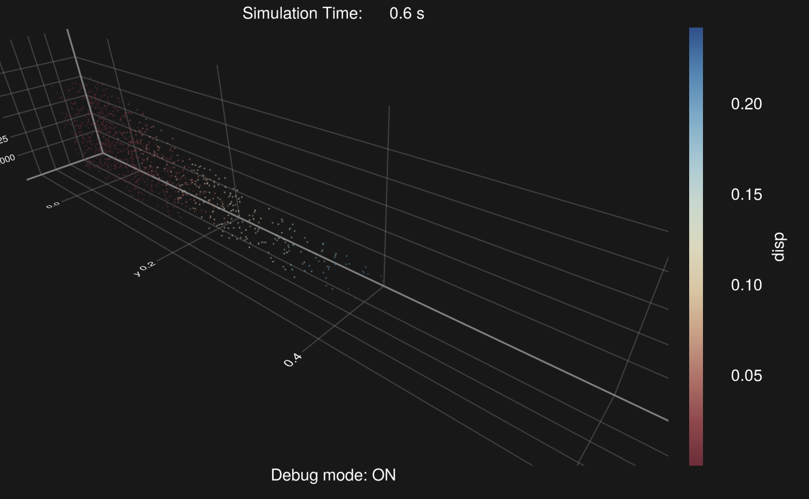

# Debug Mode (in-situ visualization)

We have provided a mode that can display simulation results in real-time, which we call "debug mode." It is also backend-agnostic and happens to enable in-situ visualization. The original intent of this design was to allow users to immediately view the computation results while running a simulation. If the results do not develop as expected, the computation can be terminated at any time for a quick code review.

Note that this feature will only be enabled after the user explicitly calls WGLMakie:

```@example debug
using MaterialPointSolver
using WGLMakie
```

!!! note

    - We implement this functionality through WGLMakie.jl, which theoretically supports computations on a remote headless server. However, as WGLMakie.jl is still in an experimental stage, we recommend launching Debug mode only on local machine for now.  
    - We prefer to always use the plot panel provided by the Julia Language plugin in VSCode to display results; please enable the plot panel in the julia-vscode plugin.  
    - The current maximum number of particles displayed is 500,000, but this can be customized by the user.

## API

In normal mode, we assume that you have already instantiated and obtained `args`, `grid`, `mp`, `attr`, and `bc`.

:::tabs

== normal mode

```julia
materialpointsolver!(args, grid, mp, attr, bc)
```

== debug mode

```julia
materialpointsolver!(args, grid, mp, attr, bc, debug)
```

:::

where the type of `debug` is `DebugConfig`:

```@docs
DebugConfig
```

The current `DebugPlot` type has only one field, `plot::DebugPlot`, but more features may be added in the future.

The type of `plot` is `DebugPlot`:

```@docs
DebugPlot
```

Here, we may need to explain the meaning of the calculate field in `DebugPlot`. Sometimes, the values we want to display might be derived from multiple attributes, such as displacement, so we need to define the computation rules.

!!! note

    - The return type of the user-defined `calculate` function must currently be a vector with the same length as the number of material points, and the input parameters of this custom function should always be: (i) `grid`, (ii) `mp`, (iii) `attr`, (iv) `bc`, and (v) vid, with the order fixed and unchangeable.  
    - Users can directly use `debug=DebugConfig()`, which will apply the default debug configuration, visualizing the color based on the density of the material points.


## Examples

If you want to visualize the equivalent plastic strain, then：

```@example debug
plotfunc(grid, mp, attr, bc, vid) = Array{Float32, 1}(mp.ϵq)
plotconfig = DebugPlot(cbname="equivalent plastic strain", calculate=plotfunc)
debug = DebugConfig(plot=plotconfig)
```

```@raw html

```

If you want to visualize the displacement：

```@example debug
function tmpf(grid, mp, attr, bc, vid)
    ξ0 = Array{Float32, 2}(mp.ξ0[vid, :])
    ξ1 = Array{Float32, 2}(mp.ξ[vid, :] )

    val = @. sqrt((ξ1[:, 1] - ξ0[:, 1])^2 .+ 
                  (ξ1[:, 2] - ξ0[:, 2])^2 .+ 
                  (ξ1[:, 3] - ξ0[:, 3])^2)
    return val
end
plotconfig = DebugPlot(pointsize=1, axis=true, axfontsize=10, calculate=tmpf, cbname="disp")
debug = DebugConfig(plotconfig)
```

```@raw html

```

If you need a smooth visualization, try to decrease the `pointsize` or `pointnum`:


```@example debug
function tmpf(grid, mp, attr, bc, vid)
    ξ0 = Array{Float32, 2}(mp.ξ0[vid, :])
    ξ1 = Array{Float32, 2}(mp.ξ[vid, :] )

    val = @. sqrt((ξ1[:, 1] - ξ0[:, 1])^2 .+ 
                  (ξ1[:, 2] - ξ0[:, 2])^2 .+ 
                  (ξ1[:, 3] - ξ0[:, 3])^2)
    return val
end
plotconfig = DebugPlot(pointsize=1f-2, axis=true, axfontsize=10, calculate=tmpf, cbname="disp", pointnum=1000) # [!code focus]
debug = DebugConfig(plotconfig)
```

```@raw html

```